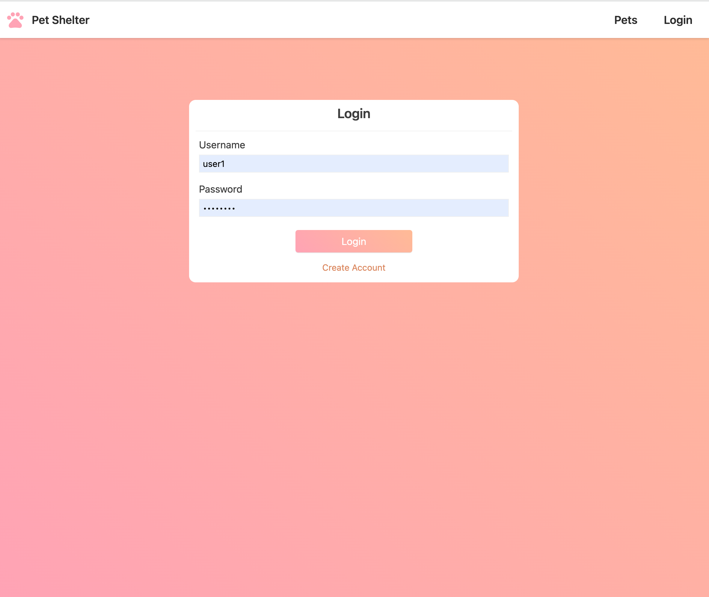

# Recruitment Task


[](#)

### angular test description
Create an Angular app which accesses the Swagger pet shop Rest API back-end running
locally and provides the following functionality:
1. Login page
2. Page to create a pet (image, name, status)
3. Page to list all the pets for a given status. For each pet in the list display name, status
a. When clicking on the pet in the list, the pet details should be displayed in a
modal using Angular Material.
4. BONUS: Implement a Redux pet state using NgXs
Please provide the code of the Angular app with relevant unit tests.
Note: The design is up to you but please provide an organised page layout.

### Screenshots

Login Page

Create User/Edit

Home page

Edit page

View Modal

Filter Modal


## Things which could be improved from this solution

- Error handling could be done better alerts
- The use of reactive-forms for better validation and observable sunscriptions
- Write some more UI tests to cover alot of the features implements
- Much more Better implementation of RxJs and Ngxs


## Installation

## Docker

To configure the back end for this app you need to pull the petstore/swagger to your local enviroment by running the commands below

```sh
docker pull swaggerapi/petstore
docker run -d -e SWAGGER_HOST=http://petstore.swagger.io \
  -e SWAGGER_URL=http://localhost \
  -e SWAGGER_BASE_PATH=/v2 -p 80:8080 swaggerapi/petstore
```

For more information check out the petstore-swagger docker link (https://hub.docker.com/r/swaggerapi/petstore)

## Angular Front End APP

Pull from the source code from the repo  ```https://github.com/bonifacemwanza/correvate.git```

Install the dependencies and devDependencies and start the server.

```sh
cd correvate
npm install
ng serve
```


By: Boniface C Mwanza


